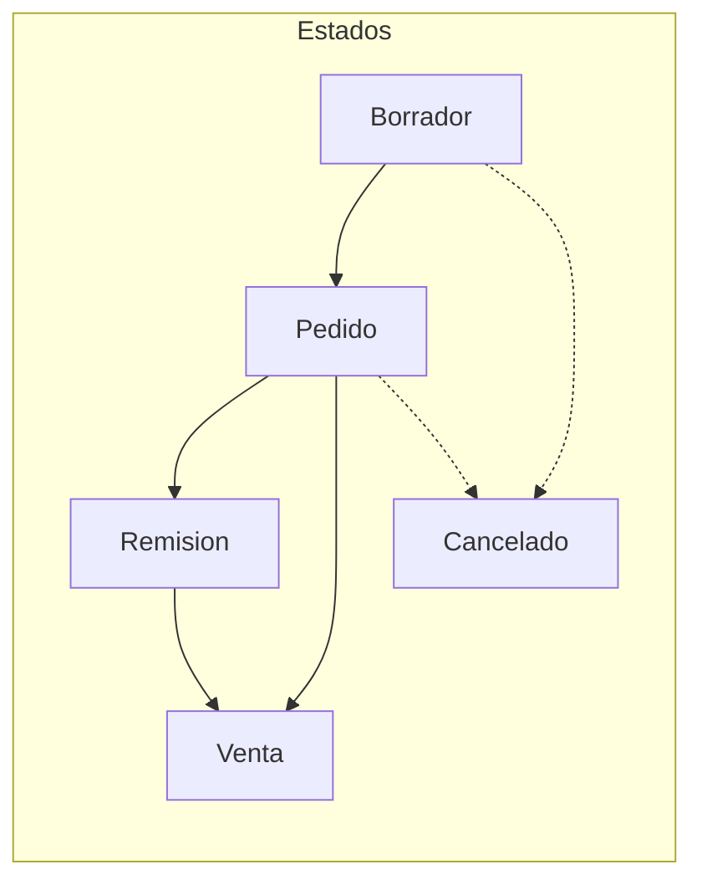

# Flujo de documentos: Pedido → Remisión → Venta

## Resumen

El flujo de órdenes pasa por tres etapas principales: **Pedido**, **Remisión** y **Venta**. El stock **no es restrictivo**: se puede completar cualquier transición aunque un producto tenga stock 0. Cuando hay stock disponible, se descuenta automáticamente.

## Estados de la orden

| Estado     | Descripción                                                |
|-----------|-------------------------------------------------------------|
| `draft`   | Borrador; orden en elaboración                             |
| `pedido`  | Solicitud del cliente confirmada; estado inicial           |
| `remision`| Remisión generada; salida de inventario registrada         |
| `venta`   | Venta registrada; documento contable obligatorio creado    |
| `cancelled` | Orden cancelada                                          |

## Transiciones permitidas

### Pedido → Remisión

- **Acción:** Generar remisión
- **Efecto:**
  - Para cada item: si `product.stock > 0`, se descuenta `min(qty, stock)` del producto.
  - Se crean registros en `inventory_movements` con `type = remision_out`.
  - Estado de la orden: `remision`.
- **Stock:** Si stock = 0, no se descuenta ni se crea movimiento; la transición se permite igual.

### Pedido → Venta (directo)

- **Acción:** Registrar venta
- **Efecto:**
  - Para cada item: si `product.stock > 0`, se descuenta `min(qty, stock)`.
  - Se crean registros en `inventory_movements` con `type = venta_out`.
  - Se crea un registro **obligatorio** en `sales_documents` (contabilidad).
  - Estado de la orden: `venta`.
- **Stock:** No es obligatorio tener stock; si hay, se descuenta.

### Remisión → Venta

- **Acción:** Registrar venta
- **Efecto:**
  - Si aún hay stock en algún item no descontado en remisión, se descuenta.
  - Se crea el registro en `sales_documents`.
  - Estado: `venta`.

## Diagrama de flujo

## Tablas afectadas

| Tabla                 | Uso                                                   |
|-----------------------|--------------------------------------------------------|
| `orders`              | Cabecera de la orden; estado y total                  |
| `order_items`         | Líneas de la orden; producto, cantidad, precio        |
| `products`            | Campo `stock`; se decrementa al generar remisión/venta|
| `inventory_movements` | Registro de salidas (`remision_out`, `venta_out`)     |
| `sales_documents`     | Obligatorio al registrar venta; uso contable          |

## Lógica de descuento de stock

- **Regla:** `stock >= 0` siempre; nunca valores negativos.
- **Cálculo:** `qty_to_deduct = min(item.qty, product.stock)`
- Si `product.stock = 0`, no se descuenta; la operación sigue permitida.

## Ejemplo de uso

1. Admin crea orden manual (pedido) con 2 productos: A (qty 5) y B (qty 3).
2. Producto A tiene stock 10; producto B tiene stock 0.
3. **Generar remisión:** Se descuentan 5 de A; B no se descuenta (stock 0).
4. **Registrar venta:** Se crea `sales_documents`; B sigue sin descuento.
